## Họ và tên: Đặng Quang Liêm
## MSSV: 17020849
### Nhóm dự án: nhóm 18
### Vai trò: Scrum master, Developer

# Báo cáo nhập môn học Công nghệ phần mềm

* Hoàn thành khóa học trên edx 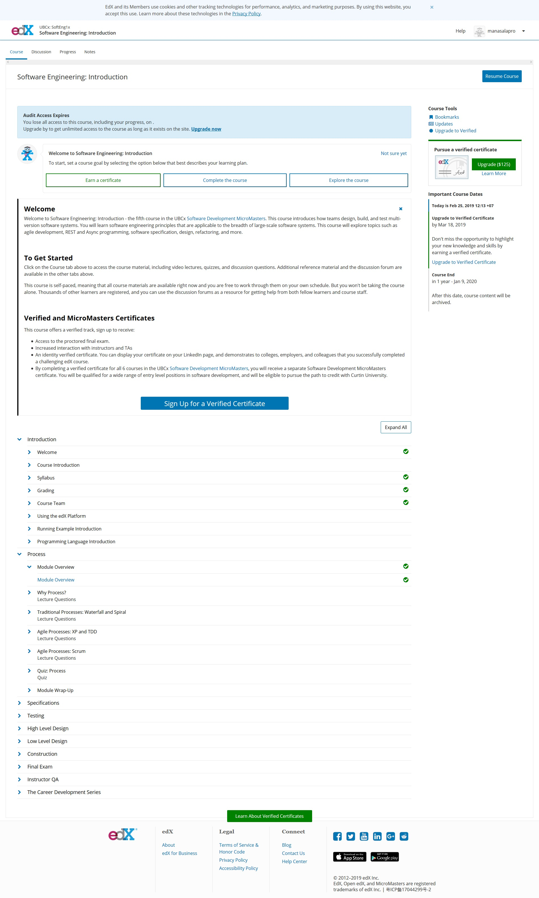
* Bài tập nhóm: **Dự án Web bán giày online**
* User story:Là một quản trị viên, tôi muốn có một trang dành riêng cho người bán quản lý thông tin về sản phẩm đang được bán của họ để họ có thể cập nhập thông tin chính về các sán phẩm cho người mua.[chi tiết](https://github.com/KhacNgoc/INT2208-7-2019/issues/9)
  1. Xây dựng giao diện:
    - Sử dụng bootstrap để viết mã nhằm tối ưu hóa giao diện.
    - chia bố cục hợp lý cho các phần.
    - thiết kế đổi mật khẩu cho tài khoản admin.
    - lựa chọn vị trí form cho từng mục.
    - lựa chọn from cho phần thêm sản phẩm
    - lựa chọn form cho danh sách sản phẩm, xóa sản phẩm, chỉnh sửa sản phẩm .
    - thiết kế giao diện quản lý đơn hàng.
  2. Xử lý việc chuyển hướng:
    - xác thực tài khoản người quản lý.
    - chuyển hướng sang trang dành riêng cho người quản lý.
    - chuyển hướng sang trang dành riêng cho người quản lý được xác thực.
    - bắt buộc đăng nhập khi chuyển đến trang quản lý.
    - chỉ có người quản lý mới có quyền sử dụng các tính năng của trang quản lý.
  3. Kiểm thử:
    - kiểm thử bố cục của trang trên các nền tảng điện thoại, máy tính, ...
    - Rà soát các lỗi mã nguồn.
    - đảm bảo các chức năng hoạt động một cách chính xác.
 * Hướng dẫn sử dụng:
 1. Đăng nhập 
    - Vào trình duyệt web, gõ vào thanh địa chỉ https://wolfshoes.000webhostapp.com/admin
    [linklogin](https://wolfshoes.000webhostapp.com/admin)
    Giao diện đăng nhập như sau: 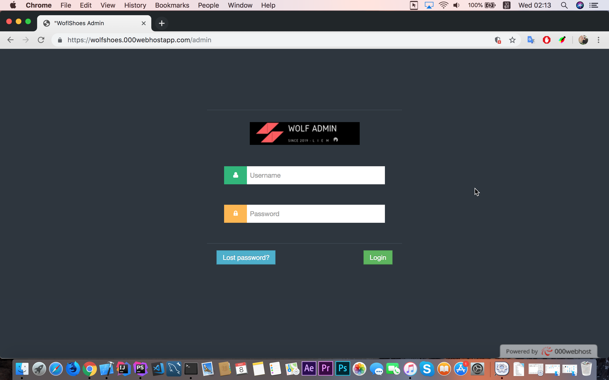
    - Điền thông tin đăng nhập, nếu đăng nhập không thành công sẽ quay trở lại trang đăng nhập và hiển thị thông báo.
    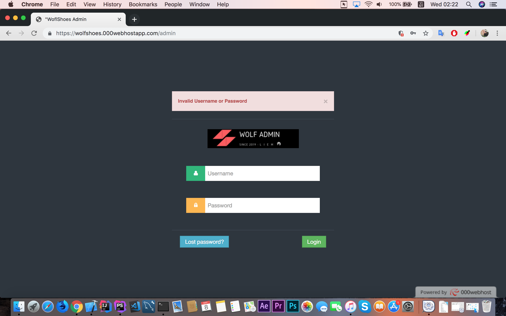
    - Nếu đăng nhập thành công, sẽ chuyển hướng đến trang dành cho người quản lý.
    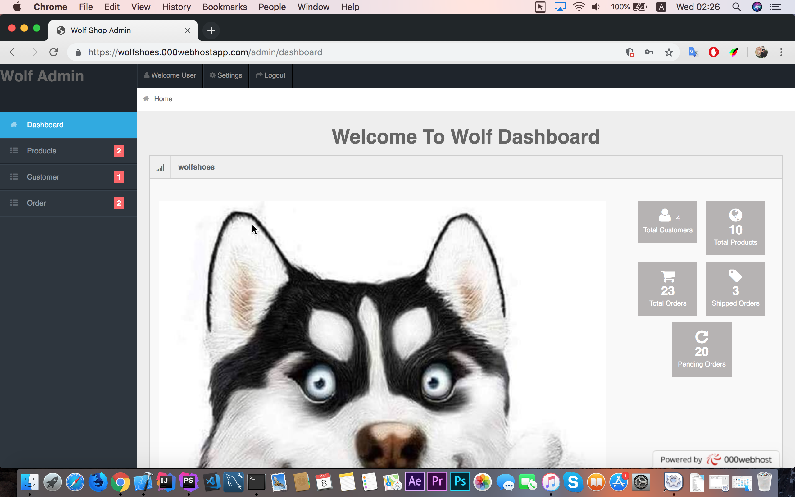
    2. Đổi mật khẩu người dùng:
    - Click vào Settings 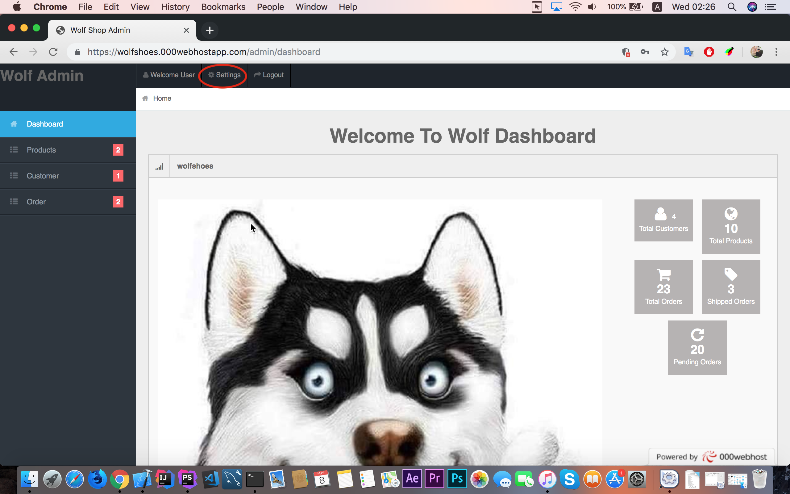
    Hiển thị ra trang đổi mật khẩu
    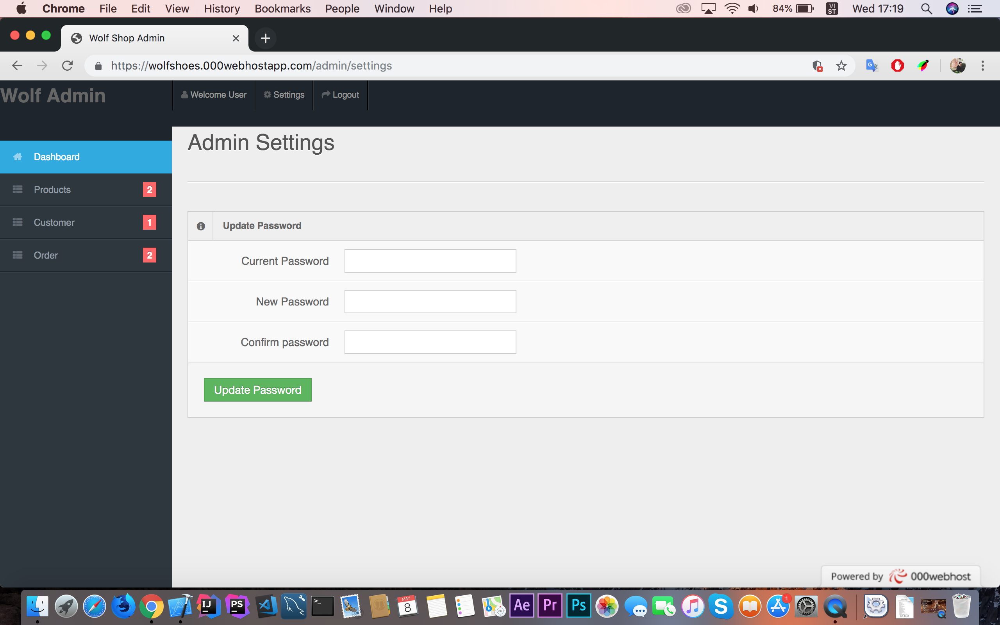
    nếu thông tin không hợp lệ sẽ hiển thị thông báo, nếu hợp lệ sẽ thông báo thành công.
    3. Upload sản phẩm:
    - Trên slidebar, click vào Products, chọn Upload Product hiện ra trang Upload sản phẩm
    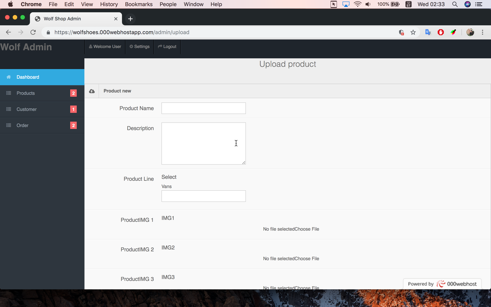
    - Tất cả các trường đều phải điền thông tin, nếu trường thông tin trống sẽ hiển thị thông báo.
    - Điền thông tin, chọn ảnh cho sản phẩm và click Button Upload để hoàn thành
    4. Hiển thị danh sách sản phẩm, chỉnh sửa sản phẩm, và xoá sản phẩm:
    - Trên slidebar click vào Products, chọn List Prducts để hiển thị danh sách sản phẩm
    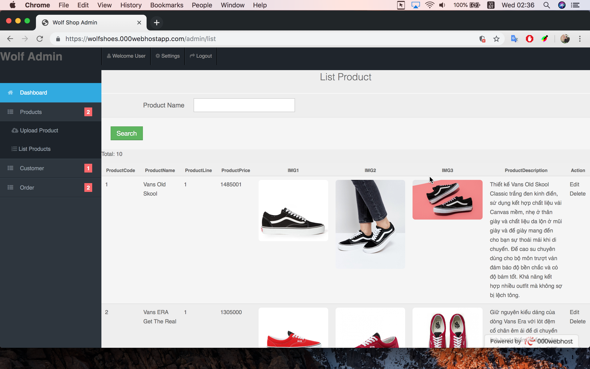
    - Muốn xoá sản phẩm, click vào delete trong cột Action
    - Muốn chỉnh sửa sản phẩm, click vào edit trong cột Action
    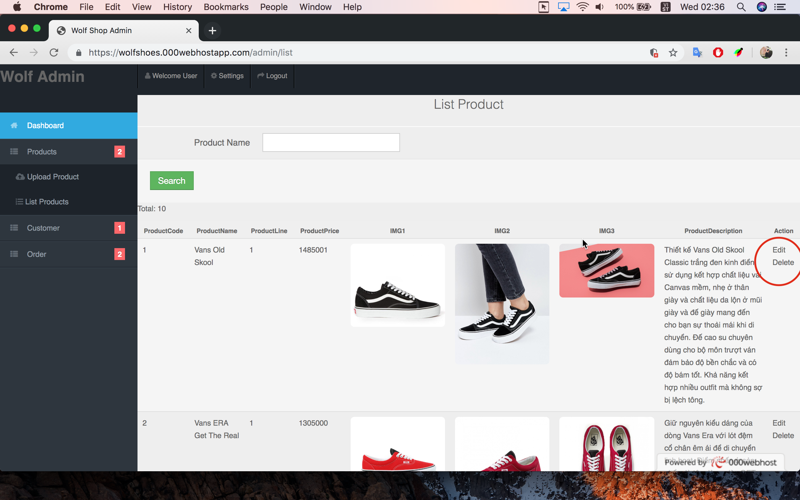
    Chuyển hướng sang trang chỉnh sửa sản phẩm.
    
    Tiến hành cập nhật thông tin sản phẩm vào click button Edit để hoàn thành, để trở về click button Cancle
    5. Hiển thị danh sách khách hàng
    - Trên slidebar, click Customer, chọn List Customer, hiển thị trang danh sách khách hàng
    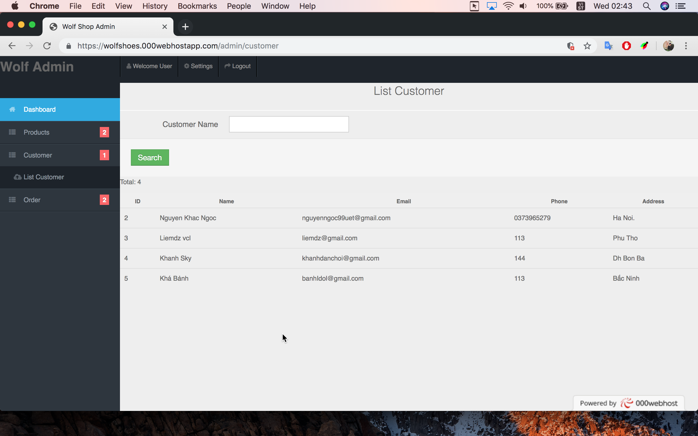
    6. Hiển thị thông tin danh sách các đơn hàng đã được gửi đi
    - Trên slidebar click Order, chọn Shipped, hiện thi ra danh sách thông tin các đơn hàng đã được gửi đi.
    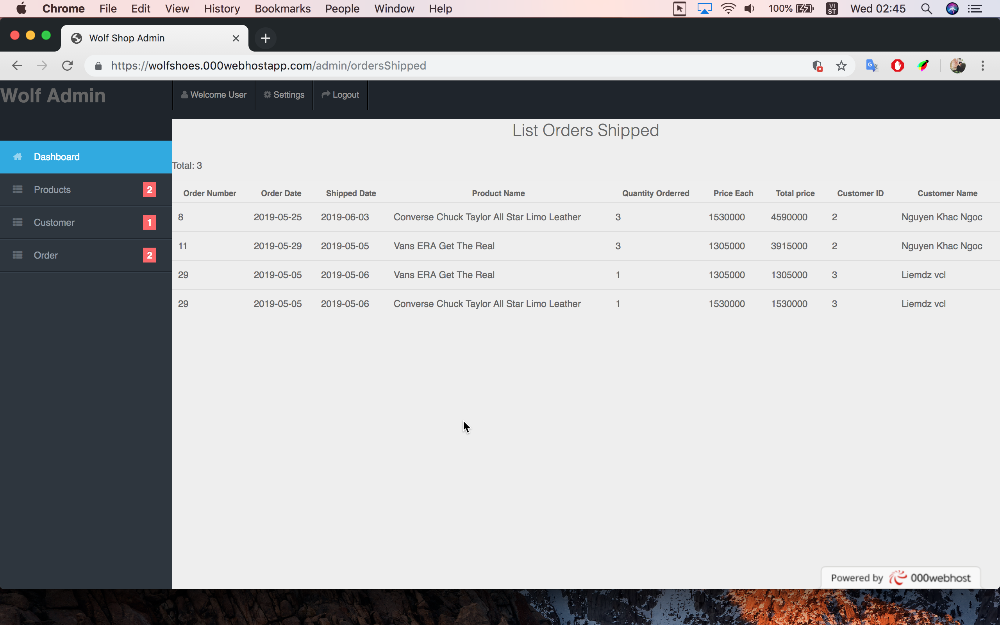
    7. Hiển thị danh sách đơn hàng đang chờ xử lý và xử lý đơn hàng.
    - Trên slidebar click Order, chọn Pending, hiển thị ra danh sách thông tin  các đơn hàng chưa được xử lý
    - Click processed trong cột action sau khi đã xử lý cá đơn hàng.
    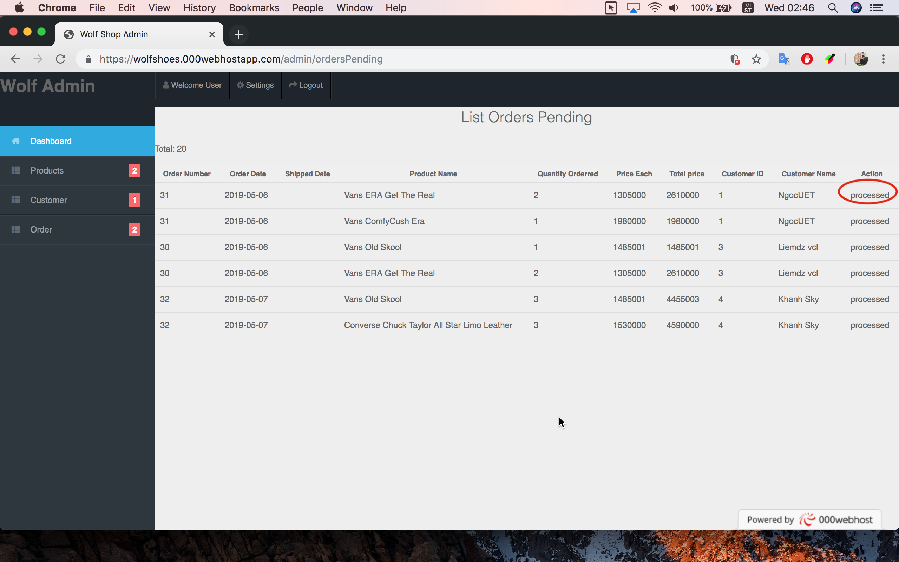
    8. Đăng xuất tài khoản admin
    - Click vào Logout để đăng xuất tài khoản
    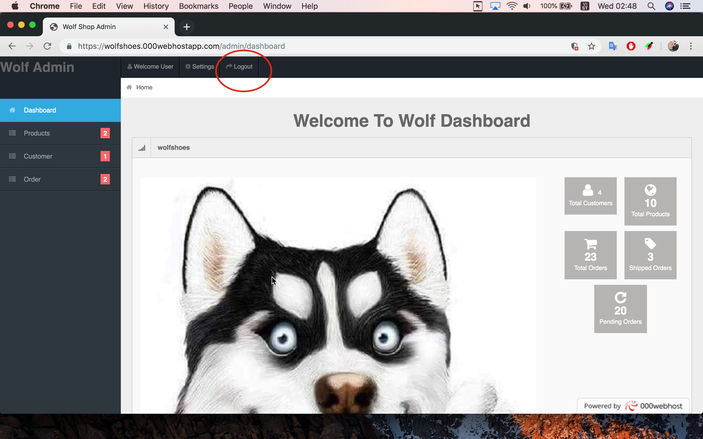
    
    

