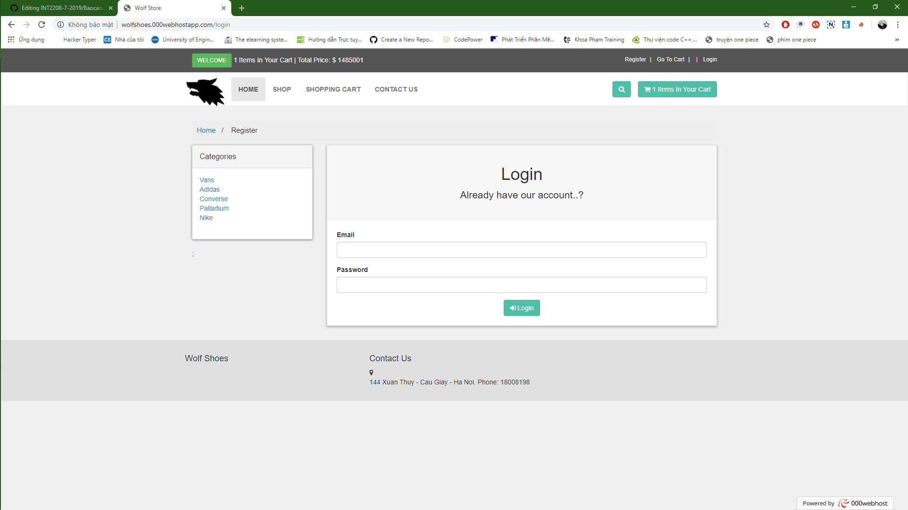
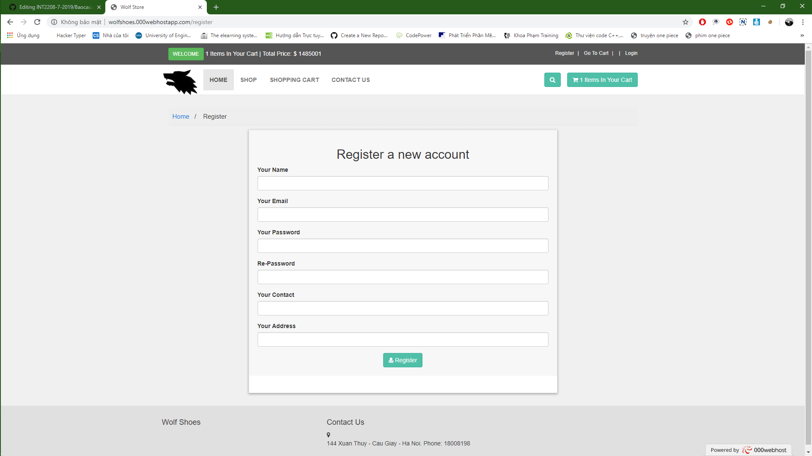

## Họ và tên: Nguyến Khắc Ngọc
## MSSV: 17020931
### Nhóm dự án: nhóm 18
### Vai trò: Product owner, Devoloper

# Báo cáo nhập môn học Công nghệ phần mềm

* Hoàn thành khóa học trên edx [chi tiết](https://github.com/KhacNgoc/INT2208-7-2019/blob/master/NguyenKhacNgoc/SoftEng1x%20edX_3.jpg)
* Bài tập nhóm: **Dự án Web bán giày online**
* User story:Là người mua hàng, tôi muốn có chức năng khách hàng có thể đăng nhập, đăng xuất, phục vụ bảo mật người dùng.[chi tiết](https://github.com/KhacNgoc/INT2208-7-2019/issues/3).

1.Phân tích, thiết kế:
  - Phân chia công việc của yêu cầu, xác định mức độ quan trọng của từng đầu việc.
  - Sử dụng bootstrap 3 để thiết kế giao diện.
  - Thiết kế giao diện login, logout.
  
2.Xử lí:
  - Ghi đầy đủ thông tin đăng kí gồm tên, email, mật khẩu, số điện thoại liên hệ, địa chỉ nhận hàng khi đặt mua hàng.
  - Kiểm tra tài khoản, mật khẩu lưu bên phía server khi khách hàng đăng kí sẽ được ẩn để bảo đảm bảo mật cho khách hàng.
  - Ghi thông tin đăng nhập chỉ lấy email và mật khẩu.
  - Tạo database lưu trữ tài khoản của khách hàng.
  - Cài đặt chức năng.
  
3.Kiểm tra:
  - Kiểm tra mật khẩu lưu bên phía server khi khách hàng đăng kí sẽ được ẩn đễ đảm bảo bảo mật cho khách hàng.
  - Kiểm tra tài khoản email bắt buộc phải là định dạng kiểu abc@gmail.com.
  - Kiểm tra mật khẩu khi người dùng đăng kí phải có độ dài từ 6 đến 20 kí tự.
  - Kiểm tra tính bắt buộc nhập của tất cả các trường khi người dùng đăng kí.
  - Check database lưu đầy đủ kí tự người dùng đăng nhập.
  - Kiểm tra đăng nhập thì người dùng mới có thể sử dụng tính năng đặt hàng.
  - Kiểm tra khi chưa đăng nhập mà khách hàng đặt hàng thì khách hàng sẽ được dẫn đến trang đăng nhập để tiến hành đặt hàng.
  - Kiểm tra bao phủ của từng hàm, nếu hàm nào chưa được gọi sử dụng thì xóa bỏ.
  - Dự đoán nơi nào của hệ thống dễ bị ẩn chứa lỗi, kiểm tra kĩ đối với từng trường hợp ở đó.
* Hướng dẫn sử dụng:
1. Phần đăng nhập, đăng xuất:
    - Sử dụng Auth trong laravel để thực hiện chức năng này.
    - Khi chưa đăng nhập thì trên thanh header hiện button 'login'
    - Khi đăng nhập thành công thanh header hiện button 'logout' và tên của người đăng nhập.
      
    - Khi đăng nhập mới sử dụng được 1 số tính năng như đặt hàng để ghi đơn hàng vào database.
    
    - Khi đăng nhập, sau khi thanh toán thì hệ thống sẽ lấy toàn bộ thông tin của khách hàng như tên, số điện thoại, địa chỉ khi khách hàng khai báo khi tạo tài khoản để gửi hàng cho khách hàng.
    - Trong khi đăng nhập, chỉ cho đăng nhập tài khoản của khách hàng trong này và không cho đăng nhập tài khoản của admin.
    - Khi đăng xuất thì thanh công cụ lại hiện lên chữ login như ban đầu.
    - Các mặt hàng trong giỏ hàng trước đó sẽ tính lại từ đầu để không gây xung đột trong các tài khoản.
2. Phần đăng kí:
    - Chức năng đăng kí gồm một số thông tin như tên, Email, Số điện thoại, địa chỉ.
    
    - Chức năng đăng kí khi ghi vào database sẽ dùng hàm Hash trước khi lưu do đó sẽ không lo về mất an toàn của tài khoản.
    - Email người dùng nhập vào khi đăng kí sẽ chỉ nhận định dạng email, nếu không đúng định dạng sẽ yêu cầu nhập lại.
    - Mật khẩu người dùng nhập vào phải có độ dài từ 6 đến 12 kí tự.
    - Phần nhập lại mật khẩu phải giống với mật khẩu nhập trước đó nếu không sẽ không cho đăng kí và bắt người dùng nhập lại cho đúng.
    - Ngoài ra tất cả các trường nhập vào trong khi đăng kí đều là bắt buộc phải không ghi thiếu thông tin nào thì mới đăng kí thành công tài khoản khách hàng.
 
