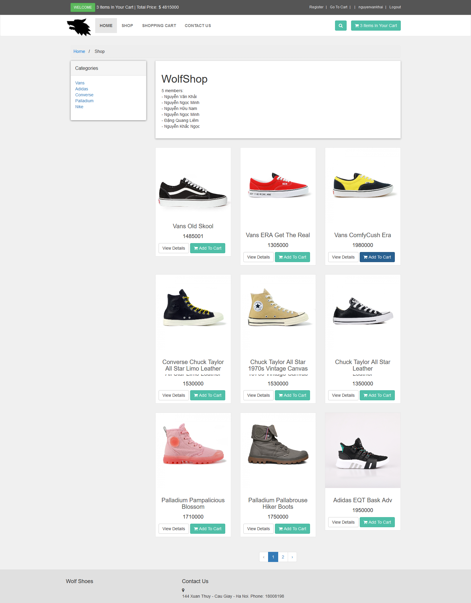
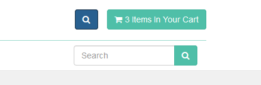
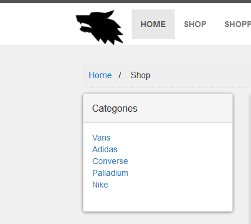
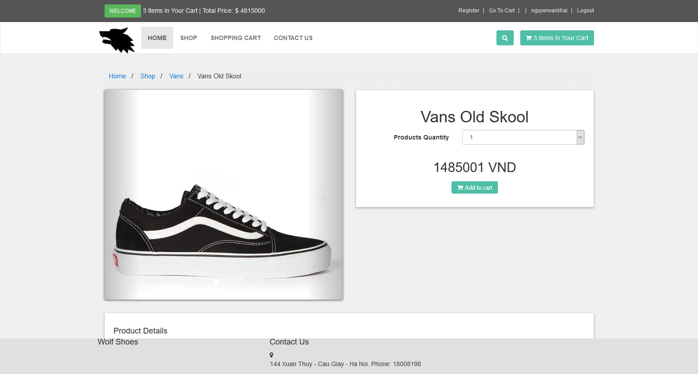

## Họ và tên: Nguyễn Ngọc Minh
## MSSV: 17020896 
### Nhóm dự án: nhóm 18
### Vai trò: Devoloper

# Báo cáo nhập môn học Công nghệ phần mềm

* Hoàn thành khóa học trên edx [chi tiết](https://github.com/KhacNgoc/INT2208-7-2019/blob/master/NguyenNgocMinh/SoftEng1x%20edX_3.jpg "chi tiết")
* Bài tập nhóm: **Dự án Web bán giày online**
* User story:
  1) Là người mua hàng, tôi muốn tìm kiếm sản phẩm, lọc sản phẩm theo giá theo loại, phục vụ mục đích mua, đặt hàng.[chi tiết](https://github.com/KhacNgoc/INT2208-7-2019/issues/4)
     - Tìm kiếm sản phẩm trực tiếp theo tên sản phẩm.
     - Phân loại được sản phẩm theo từng danh mục sản phẩm phổ biến,sắp xếp sản phẩm theo giá tiền mà khách hàng mong muốn.
     - Sử dụng bootstrap để tối ưu hóa giao diện.
     - Test chức năng, kiểm tra tính ổn định, hoạt động chính xác.
  2) Là một người mua hàng, tôi muốn nhìn thấy rõ các thông tin mô tả chi tiết và hình ảnh của sản phẩm để tôi có chọn lựa và hiểu rõ về sản phẩm mà mình đặt mua.[chi tiết](https://github.com/KhacNgoc/INT2208-7-2019/issues/8)
      - Tạo giao diện hiển thị sản phẩm.
      - Chia bố cục hợp lý, bắt mắt.
      - Sử dụng bootstrap để tối ưu hóa giao diện.
      - Bố cục sản phẩm bao gồm: hình ảnh hiển thị, tên sản phẩm, giá sản phẩm, mô tả chi tiết sản phẩm.
      - Kết nối với cơ sở dữ liệu lưu trữ thông tin sản phẩm để hiển thị thông tin.
      - kiểm thử hiển thị giao diện trên các thiết bị.
 ### Phân tích câu chuyện
 1.  Xác định yêu cầu, mong muốn: gửi phản hồi về chủ shop (specifications).
2.  Chọn quy trình phát triển Scrum (process).
3.  Thiết kế cấu trúc cơ sở dữ liệu và sơ đồ lớp (high level design).
4.  Sử dụng mô hình MVC trên framework Laravel (low level design).
5.  Viết mã 
6.  Kiểm thử hộp trắng rồi kiểm thử hộp đen từng phần và kiểm thử hệ thống đánh giá (testing)
* Hướng dẫn sử dụng:
  1) Mở trình duyệt web lên.
  2) Nhập địa chỉ sau để mở trang web http://wolfshoes.000webhostapp.com.
  3) Sau khi trang web xuất hiện là giao diện Home của trang web
  
  4) Muốn tìm kiếm sản phẩm nhập tên sản phẩm vào ô Search, sau đó click vào icon tìm kiếm để tìm kiếm sản phẩm mong muốn.
  
  5) Muốn lọc sản phẩm theo từng danh mục chú ý Menu **Categories** sau đó chọn danh mục sản phẩm mong muốn.
  
  6) Muốn xem chi tiết sản phẩm chú ý vào phần khung hiển thị sản phẩm click vào **Viewdetails** thông tin chi tiết sản phẩm hiển thị như sau
  
