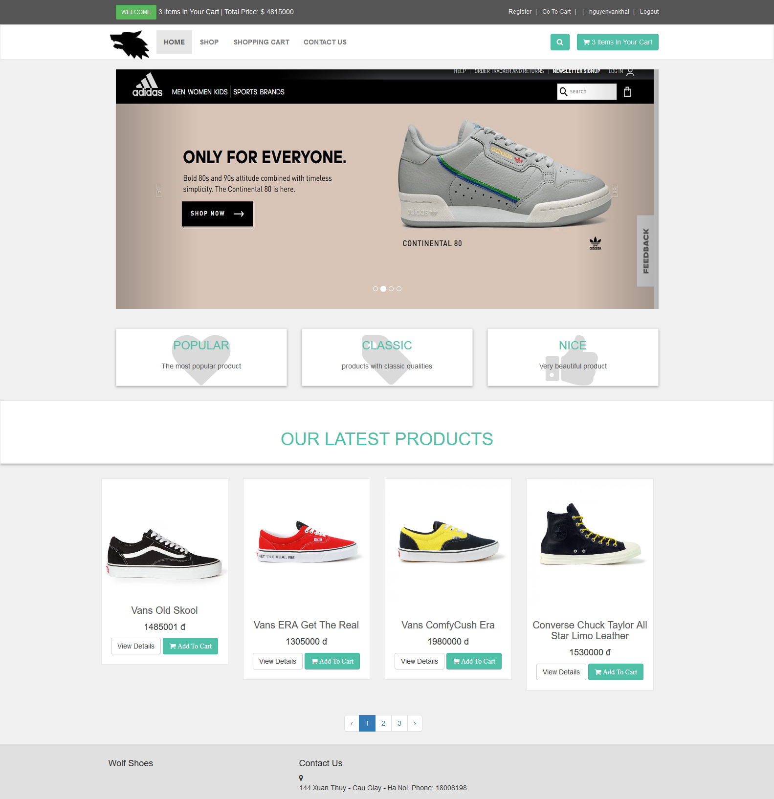
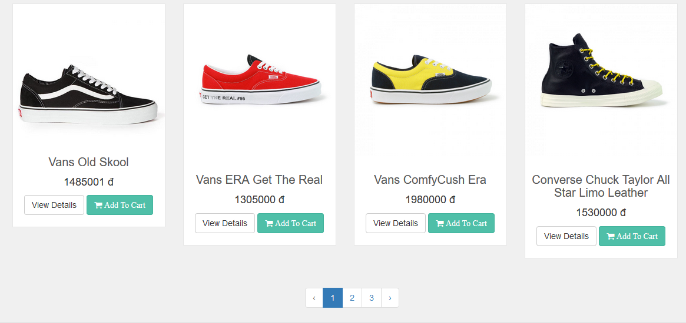
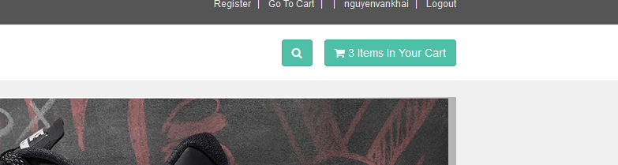
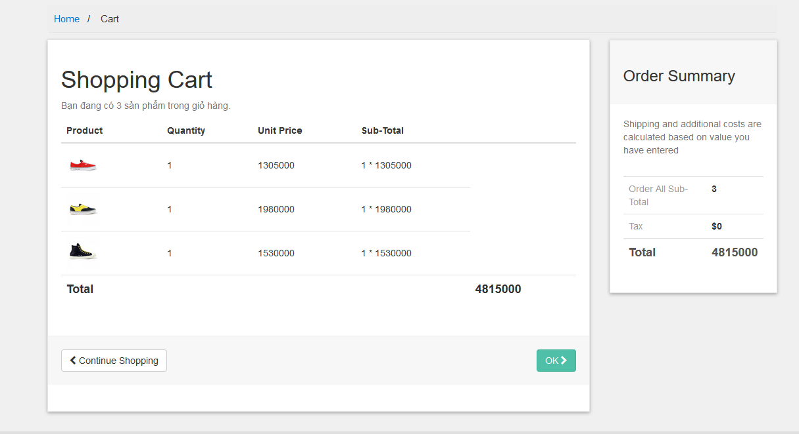

## Sinh viên: Nguyễn Văn Khải
## Mã sinh viên: 17020829
### Nhóm dự án: Nhóm 18
### Vai trò: Developer.

# Báo cáo cá nhân môn học Công nghệ phần mềm
====
* Bài tập nhóm: **Dự án web bán giày online** [website](https://wolfshoes.000webhostapp.com/?fbclid=IwAR0LDgI2rd9H5pLcg6987GcpeCmCIfu4VtG5K-ilGNUKwsfSlQQRU2h-Fn0), [Github](https://github.com/KhacNgoc/INT2208-7-2019)
* User story: Là người mua hàng, tôi muốn thêm vào giỏ hàng và nhớ giỏ hàng sau mỗi lần đăng nhập lại, phục vụ mục đích đặt hàng.
	[chi tiết]():
	1) Xác định yêu cầu, mong muốn: 
		- Thêm và nhớ giỏ hàng sau những phiên đăng nhập (yêu cầu chức năng - specifications)
	2) Quy trình phát triển Scrum (process)
	3) Thiết kế cấu trúc cơ sở dữ liệu và sơ đồ lớp (high level design)
	4) Sử dụng mô hình MVC của framework Laravel (low level design)
	5) Viết mã([chi tiết]())
	6) Kiểm thử:
		- Kiểm thử hộp trắng đảm bảo mã nguồn không bị lỗi, build và run được.
		- Sử dụng localhost kiểm tra xem web có thêm vào giỏ hàng sau khi nhấp chuột vào thêm vào giỏ hàng hay không.
		- Sử dụng localhost để kiểm tra xem web có lưu lại giỏ hàng của phiên đăng nhập trước ở phiên đăng nhập này hay không.
		- Khi nhấp chuột vào giỏ hàng thì có chuyển đến trang tính tiền hay không. 
	7) Tái cấu trúc: Rà soát mã nguồn để đảm bảo rõ ràng, đơn giản, sạch sẽ và không có mã xấu.(construction)
* Hướng dẫn sử dụng:
1. Mở trình duyệt của bạn lên. Google chrome, Cococ hoặc FireFox,... tùy trình duyệt bạn cài đặt.

2. Gõ vào ô tìm kiếm địa chỉ sau: [website](https://wolfshoes.000webhostapp.com)

3. Sau khi trang web hiện ra bạn sẽ nhìn thấy trang web tổng quan, trên cùng góc phải là giỏ hàng của bạn, dưới mỗi sản phẩm có nút "Add to cart" ta nhấp chuột vào nếu muốn thêm sản phẩm vào giỏ hàng.

4. Nếu khách không đăng nhập, giỏ hàng của bạn chỉ được sử dụng trong phiên làm việc hiện tại. Khách đã đăng nhập, phần giỏ hàng có thể lưu lại để làm việc ở phên đăng nhập sau.
5. Chọn mặt hàng bạn muốn mua và nhấp nút "Add to cart".

6. Sản phẩm của bạn đã được thêm vào giỏ hàng.

7. Nhấp chuột vào giỏ hàng sẽ chuyển hướng sang trang tính tiền sản phẩm.

