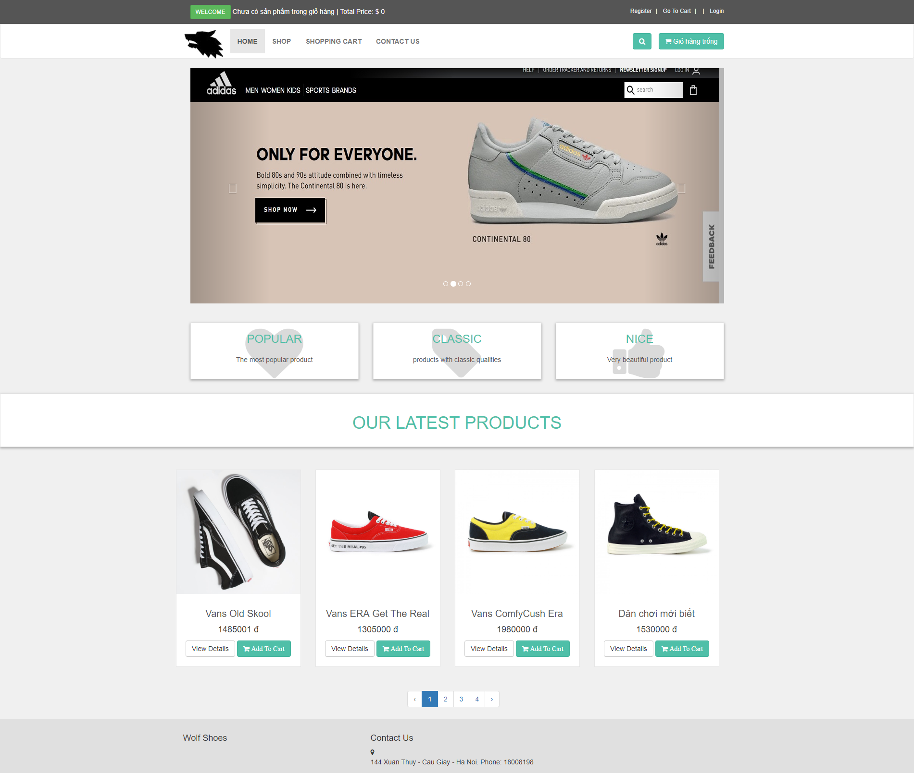

# INT2208-7-2019
##Nhóm 18 
### Thành Viên:
#### Nguyễn Hữu Nam
#### Nguyễn Văn Khải
#### Nguyễn Ngọc Minh
#### Đặng Quang Liêm
#### Nguyễn Khắc Ngọc

### Link sản phẩm: https://wolfshoes.000webhostapp.com/
### Tên sản phẩm: WolfShoes
**Người sử dụng:** những cửa hàng giày có nhu cầu bán sản phẩm trên mạng internet, những người có nhu cầu mua giày online giao hàng tận nhà.
### **Mô tả phần mềm:**
  - Đây là một trang web mua bán online. Mục đích là giúp cửa hàng giao bán những sản phẩm mà mình có lên mạng internet đến những khác hàng có nhu cầu mua hàng tại nhà.
  - Thêm vào đó trang web còn có chức năng quản lý sản phẩm, đơn hàng thuận tiện cho người mua và cả cửa hàng trong việc giao hàng đến cho khách.
  -Bên dưới là giao diện cơ bản của trang web.
   
   # SCRUM
## Vai trò:
###	Product Owner: Ngọc
   - Định hình và đưa ra yêu cầu về tính năng sản phẩm.
###	Scrum Master: Liêm
   - Đảm bảo sự vận hành của nhóm
###	Team Development: cả nhóm
   - Tạo ra sản phẩm dựa trên Product backlog.
## Product backlog:
   - Thiết kế giao diện trang chủ.
   - Thiết kế giao diện login.
   - Thiết kế giao diện admin.
   - Thông tin sản phẩm.
## Tuần 1-4:
-	**Kế hoạch:** Học bootstrap và hoàn thành giao diện trang chính.
-  **Công việc:**
   1. Frontend:
   - Tự học HTML, CSS, JS, Bootstrap 3.
   - Sử dụng kiến thức học được tạo giao diện trang chính.
   2. Backend:
   - Học PHP, framework Laravel.
   - Tìm hiểu MVC.
   - Cở sở dữ liệu MySQL.
   - Ngôn ngữ truy vấn QueryBuilder.
## Tuần 5-6:
-	**Kế hoạch:** Hoàn thành phần thiết kế giao diện các trang liên quan.
-  **Công việc:**
    - Tạo giao diện trang chủ, login, logout.
    - Tạo class cart trong đó có các function như thêm giỏ hàng, xóa giỏ hàng,...
    - Tạo Khung mô tả chi tiết sản phẩm.
    - Thiết kế mô hình ER để hình dung được cấu trúc của database cố gắng thống nhất mô hình trong vòng 1 tuần.
    - Chuyển từ mô hình ER sang cài đặt vật lý trên nền tảng MySQL, phải đảm bảo database đạt chuẩn 3 trở lên.
   
## Tuần 7-9:
-	**Kế hoạch:** Tạo giao diện, tạo cơ cở dữ liệu các sản phẩm, đăng nhập đăng xuất cho admin và khách hàng.
   - Tạo giao diện hiển thị sản phẩm.
   - Ghi dữ liệu vào databse.
   - Kết nối database.
   - Đổ dữ liệu ra các giao diện từ dữ liệu ghi vào database.
   - Tạo đăng kí, đăng nhập cho khách hàng ghi dữ liệu đăng kí vào databse.
   - Tìm kiếm dữ liệu sản phẩm.
   - Tạo giao diện trang admin và các chức năng admin (đăng kí, đăng bán sản phẩm, sửa thông tin sản phẩm, danh sách đơn hàng đang sử lí, ...)
## Tuần 10-13:
-	**Kế hoạch:** Hoàn thành chức năng tìm kiếm, Lọc sản phẩm theo danh mục, hoàn thành đặt hàng, liên hệ admin.
-  **Công việc:**
   - Sử dụng Truy vấn QueryBuildedr để truy xuất sản phẩm.
   - Tiếp tục bổ sung dữ liệu vào database.
   - Tạo giao diện tìm kiếm, lọc sản phẩm.
   - Tạo bước đặt hàng lưu lại thông tin khách hàng cũng như đơn hàng khi khách hàng thanh toán.
   - Tạo giao diện liên hệ với admin.
   -  Cài đặt phần liên hệ gửi qua email của admin.
## Tuần 14:
-	**Kế hoạch:** Kiểm thử và hoàn thành 4 chức năng chính và viết báo cáo.
-  **Công việc:**
   - Hoàn thanh đầy đủ các chức năng 
   - Viết báo cáo cá nhân.
   - Tạo tài liệu kỹ thuật và quay video demo dự án.
   
